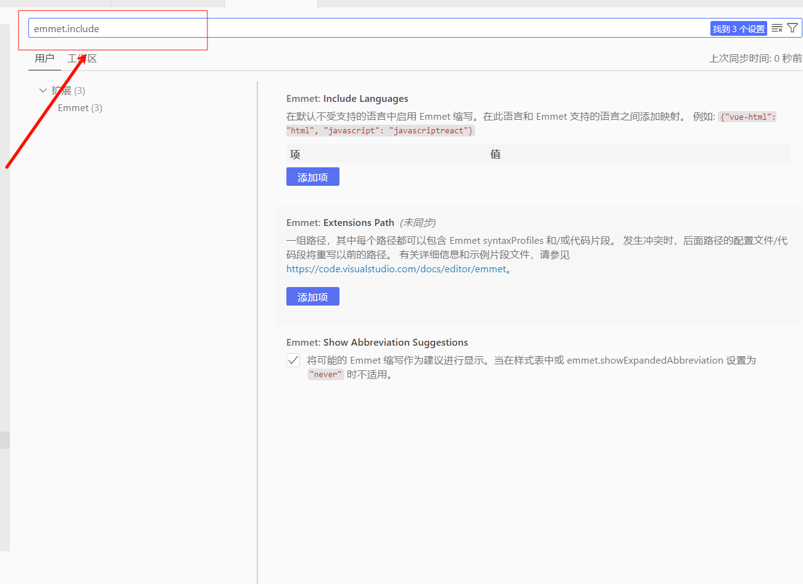

# Vue前台模板

使用vite做了以下集成：

✅自动引入组件库组件 element-plus

✅unplugin-vue-router自动引入路由

🔨使用iconfiy对icon组件封装

🔨极致封装axios

* 将请求处理、响应处理、请求拦截器、请求错误拦截器、响应拦截器、响应错误拦截器统一封装成一个类 => axiosTransoform.ts
* 将其他辅助函数，如：检查响应状态码，拼接时间戳，格式化时间，url params拼接等 => checkStatus.ts，helps.ts
* 取消请求处理 => axiosCancel.ts
* 整体导出的实例封装 => instance.ts

​	注意：没有对需要token检验进行封装，因为这是一个模板，不一定需要用户鉴权，如需要则去axiosTransoform.ts去定义；如果在项目中觉得这个axios不需要封装，	删除文件夹即可。

🔨简单的代码校验规范 EsLint + Prettier

1. Prettier配置

   ```yaml
   # 参考网址：https://prettier.nodejs.cn/
   
   # 单行长度
   printWidth: 100
   # 缩进长度
   tabWidth: 2
   # 使用空格代替tab缩进
   useTabs: false
   # 句末使用分号
   semi: false
   # 使用单引号
   singleQuote: false
   # 仅在必需时为对象的key添加引号
   quoteProps: as-needed
   # jsx中使用单引号
   jsxSingleQuote: true
   # 多行时尽可能打印尾随逗号
   trailingComma: all
   # 在对象前后添加空格-eg: { foo: bar }
   bracketSpacing: true
   # 多属性html标签的‘>’折行放置
   jsxBracketSameLine: true
   # 单参数箭头函数参数周围使用圆括号-eg: (x) => x
   arrowParens: always
   # 如果超过打印宽度，则换行。
   proseWrap: always
   # 无需顶部注释即可格式化
   requirePragma: false
   # 在已被preitter格式化的文件顶部加上标注
   insertPragma: false
   # 对HTML全局空白不敏感
   htmlWhitespaceSensitivity: ignore
   # 不对vue中的script及style标签缩进
   vueIndentScriptAndStyle: false
   # 结束行形式
   endOfLine: auto
   # 对引用代码进行格式化
   embeddedLanguageFormatting: auto
   ```

2. vscode保存自动格式化配置

   步骤：

   1. 在vscode设置中搜索`emmet.include`

      

   2. 在`Emmet: Include Languages`配置中添加项`editor.formatOnType`:`true`和`editor.formatOnSave`:`true`

      

   3. 在设置中搜索格式化，在`Editor: Format On Save`开启在保存时格式化文件

      

`TODO`:

▶️ [任务列表](https://o0ke9xr7eb.feishu.cn/sheets/JEifsQ7TNh9yR8tlahfcaafNnfd?from=from_copylink)
